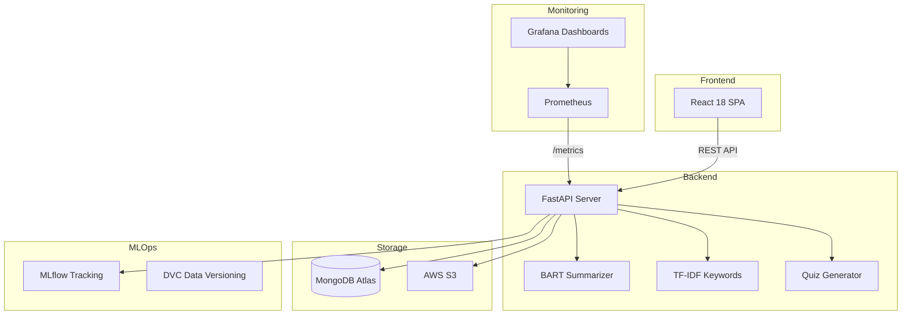

# 📚 Personalized E-Learning Assistant

> Upload PDFs & notes → Get AI summaries, keywords & quizzes instantly.  
> Built for Pakistani students | English + اردو Support

---

## 🏗️ Architecture



## 🛠️ Tech Stack

| Layer | Technologies |
|-------|-------------|
| **Frontend** | React 18, Vanilla CSS (dark theme, glassmorphism) |
| **Backend** | FastAPI, Uvicorn, Pydantic |
| **NLP/ML** | HuggingFace Transformers (BART), TF-IDF (scikit-learn) |
| **Database** | MongoDB Atlas (Motor async driver) |
| **Storage** | AWS S3 (boto3) |
| **MLOps** | MLflow, DVC |
| **Containers** | Docker, Docker Compose |
| **Orchestration** | Kubernetes (NGINX Ingress) |
| **CI/CD** | GitHub Actions |
| **Monitoring** | Prometheus + Grafana |

## 📁 Project Structure

```
personalized-e-learning-assistant/
├── backend/
│   ├── app/
│   │   ├── main.py              # FastAPI app + lifecycle
│   │   ├── utils.py             # Response formatting, text helpers
│   │   ├── models/
│   │   │   └── user.py          # MongoDB models (User, PDF, Quiz, Attempt, Progress)
│   │   ├── routes/
│   │   │   └── upload.py        # API endpoints (/upload, /submit-quiz, /progress)
│   │   └── services/
│   │       ├── text_extraction.py   # PDF/DOCX/image text extraction
│   │       ├── summarizer.py        # BART + extractive summarization
│   │       ├── keywords.py          # TF-IDF + frequency keyword extraction
│   │       ├── quiz_generator.py    # MCQ generation from facts
│   │       ├── s3_upload.py         # AWS S3 file storage
│   │       └── mlflow_tracking.py   # Experiment tracking
│   ├── Dockerfile
│   └── requirements.txt
├── frontend/
│   ├── src/
│   │   ├── App.jsx              # Main app with tabs
│   │   ├── App.css              # Premium dark theme CSS
│   │   ├── api.js               # API service layer
│   │   └── components/
│   │       ├── UploadForm.jsx       # Drag & drop file upload
│   │       ├── SummaryDisplay.jsx   # Summary + keywords (glassmorphism)
│   │       ├── Quiz.jsx            # Interactive MCQ quiz
│   │       └── ProgressDashboard.jsx # Learning analytics
│   ├── Dockerfile
│   └── package.json
├── k8s/
│   ├── deployment.yaml          # K8s deployments + services
│   ├── ingress.yaml             # NGINX Ingress routing
│   └── configmap.yaml           # ConfigMap + Secrets
├── monitoring/
│   ├── prometheus.yml           # Prometheus scrape config
│   └── grafana/
│       └── dashboard.json       # Pre-built Grafana dashboard
├── .github/workflows/
│   ├── ci.yml                   # Lint + test + build
│   └── deploy.yml               # Build → push → K8s deploy
├── docker-compose.yml           # Full stack (backend, frontend, mongo, prometheus, grafana)
├── .env.example                 # Environment variable template
└── ml_models/                   # ML model artifacts
```

## 🚀 Quick Start

### Prerequisites

- Python 3.10+
- Node.js 18+
- MongoDB Atlas account (or local MongoDB)

### 1. Clone & Configure

```bash
git clone https://github.com/MudassarGill/End-to-End-Personalized-E-Learning-Assistant.git
cd End-to-End-Personalized-E-Learning-Assistant/personalized-e-learning-assistant
cp .env.example .env
# Edit .env with your MongoDB URI, AWS keys, etc.
```

### 2. Backend

```bash
cd backend
python -m venv venv
venv\Scripts\activate        # Windows
pip install -r requirements.txt
python -m app.main           # Starts on http://localhost:8000
```

### 3. Frontend

```bash
cd frontend
npm install
npm start                    # Starts on http://localhost:3000
```

### 4. Docker (Full Stack)

```bash
docker compose up --build
# Backend:    http://localhost:8000
# Frontend:   http://localhost:3000
# Prometheus: http://localhost:9090
# Grafana:    http://localhost:3001 (admin/admin)
```

## 📡 API Reference

| Method | Endpoint | Description |
|--------|----------|-------------|
| `POST` | `/api/upload` | Upload PDF/DOCX → get summary, keywords, quiz |
| `POST` | `/api/upload/text` | Process raw text input |
| `POST` | `/api/submit-quiz` | Submit quiz answers → get score |
| `GET` | `/api/progress/{user_id}` | Get learning progress & stats |
| `GET` | `/api/quiz/{quiz_id}` | Get a specific quiz |
| `GET` | `/api/user/{user_id}/quizzes` | List user's quizzes (paginated) |
| `GET` | `/health` | Health check (MongoDB status) |
| `GET` | `/metrics` | Prometheus metrics |

## 🔧 Configuration

All config is via environment variables (see `.env.example`):

| Variable | Description | Default |
|----------|-------------|---------|
| `MONGODB_URI` | MongoDB connection string | `mongodb://localhost:27017` |
| `MONGODB_DB` | Database name | `elearning_db` |
| `AWS_S3_BUCKET` | S3 bucket for file storage | `elearning-uploads` |
| `AWS_REGION` | AWS region | `us-east-1` |
| `MLFLOW_TRACKING_URI` | MLflow server URL | (disabled if empty) |

## ☸️ Kubernetes Deployment

```bash
# Apply configs
kubectl apply -f k8s/configmap.yaml
kubectl apply -f k8s/deployment.yaml
kubectl apply -f k8s/ingress.yaml

# Verify
kubectl get pods
kubectl get ingress
```

## � Monitoring

- **Prometheus** scrapes `/metrics` from the backend every 15s
- **Grafana** dashboard shows: request rate, p95 latency, error rate, memory/CPU usage
- Access Grafana at `http://localhost:3001` (default: admin/admin)

## 🤖 NLP Pipeline

1. **Text Extraction** — PyPDF2 / PDFPlumber (PDF), python-docx (DOCX), pytesseract (images)
2. **Summarization** — BART (`facebook/bart-large-cnn`) with extractive fallback
3. **Keywords** — TF-IDF (scikit-learn) with frequency-based fallback; supports Urdu
4. **Quiz Generation** — Fact extraction via regex patterns → MCQ creation with plausible distractors

## 📄 License

MIT License — See [LICENSE](LICENSE)
